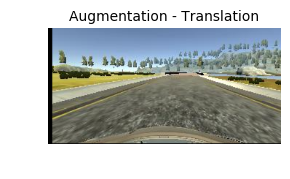

# Behavioral Cloning

---

## Data Collection

Initially I collected several laps using the simulator.
For several days I tried training different models and I was not getting good results.

Since other students were getting good results with the provided sample dataset I decided to switch to that dataset to ensure that the issues that I was seeing were not related to the data I collected.

For the rest of this report I decided to use only the provided sample dataset.

Later on, when I got good results I switched back to my dataset and it turn out to be correct as well. I just need to find the right model.

---

## Exploratory Data Analysis

Let's review the images and metadata generated by the simulator.

#### Directory Structure

    .
    ├── data
    │   ├── driving_log.csv
    │   └── IMG
    │       ├── center_2016_12_01_13_30_48_287.jpg
    │       ├── center_2016_12_01_13_30_48_404.jpg
    │       ├── center_2016_12_01_13_31_12_937.jpg
    │       ├── center_2016_12_01_13_31_13_037.jpg

The columns of `driving_log.csv` are:

    - Center Image
    - Left Image
    - Right Image
    - Steering Angle
    - Throttle
    - Break
    - Speed

#### Steering Angle

From the steering angle histogram below, we appreciate negative, positive and a large amount of near zero values. Negative values are from turning the wheel to the left side, positive to the right and zero when we are driving straight.

#### Images

Let's preview some of the images from the left, center and right cameras.

Each of the images offers a different perspective.
We use the steering angle as output of the center image.

---

## Data Preprocessing

Let's generate our testing, training and validation sets. At this point, only the file paths and steering values are manipulated. The images will be loaded in memory during the training phase.

After several experiments using the steering angle including all the data where the steering angle is zero, the model never performed well.
The same issue is described in the paper [End-to-End Deep Learning for Self-Driving Cars](https://images.nvidia.com/content/tegra/automotive/images/2016/solutions/pdf/end-to-end-dl-using-px.pdf) and [blog](https://devblogs.nvidia.com/parallelforall/deep-learning-self-driving-cars/).

In their paper they reduce the data for which the steering angle is from driving straight.

In this project after a few trials, I decided to remove completely the data with exactly zero steering angle.

That make the model drive the car more smoothly.

Now the steering angle data has an almost gaussian distribution, with steering angles at extremes containing a few samples. This points out that we would need to increment our samples, either collecting more samples or artificially aumenting the dataset. I chose the later one.

#### Data Augmentation

In addition to the original camera images, let's generate synthetic images from the original images using transformations. The transformations were based on the source code from these sources:

- [Keras' ImageDataGenerator](https://keras.io/preprocessing/image/)
- [Kaggle's Plankton Competition Winner](http://benanne.github.io/2015/03/17/plankton.html)
- [Image Augmentation with Keras](http://machinelearningmastery.com/image-augmentation-deep-learning-keras/)
- [Vivek Yadav's An augmentation based deep neural network approach to learn human driving behavior](https://chatbotslife.com/using-augmentation-to-mimic-human-driving-496b569760a9#.egwkyuy0t)

In particular the functions for shadow, brightness and translation augmentation were taken from Vivek's example.

The following image augmentation methods were used:

- brightness (transforms image)
- shadow (transforms image)
- flip (transforms image and angle)
- translation (transforms image and angle)
- rotation (transforms image and angle)

Another important feature that improved dramatically the performance of the model was cropping.

I removed the top 80 pixel rows and the bottom 20 pixel rows. This to remove the scenary (sky, trees, mountains on the top of the image and the car hood on the bottom of the image) and allow the model to focus more on the road itself.

That reduced the size of the image from **160 x 320** pixels to **60 x 320** pixels.

Some of the artificially augmented images look like this:

#### Generate the training, validation and testing datasets

I split the dataset into training, validation and testing datasets.

---

## Model Architecture Design

For the initial design, I decided to start with the model from [comma.ai](http://comma.ai/) found in their GitHub repo [research](https://github.com/commaai/research) in the file [train_steering_model.py](https://github.com/commaai/research/blob/master/train_steering_model.py#L24-L46)

The original **comma.ai** model has the following layers:

    Input Image (160 x 320 x 3)
    Normalization (Lambda layer with MinMax between -1.0 and 1.0)
    Convolution (16, 8, 8)
    ELU
    Convolution (32, 5, 5)
    ELU
    Convolution (64, 5, 5)
    Flatten
    Dropout (0.2)
    ELU
    Dense (512)
    Dropout (0.5)
    ELU
    Dense (1)

Inititally I tried that model, but in none of my trials the model was able to drive the car the whole track. The car will drive a few turns and then leave the track. During training the validation loss was constant, it was not decreasing. That was a hint that the model was not learning.

First I tried adding an extra convolutional layer to each convolution block, but still the model was not decreasing its validation loss.

Then I added a third layer to each convolution block that will allow the model extract additional features, increasing its number of parameters and the validation loss finally was decreasing as the epochs increased.

That model was still driving the car in an unstable direction (wobbly maneuvering), but it was able to complete a lap without leaving the track.

To reduce the "wobbly maneuvering" I added two additional fully connected layers at the end of the model. That first working model had the following layers:

    Input Image (160 x 320 x 3)
    Normalization (Lambda layer with MinMax between -1.0 and 1.0)
    Convolution (16, 8, 8)
    Convolution (16, 8, 8)
    Convolution (16, 8, 8)
    ELU
    Convolution (32, 5, 5)
    Convolution (32, 5, 5)
    Convolution (32, 5, 5)
    ELU
    Convolution (64, 5, 5)
    Convolution (64, 5, 5)
    Convolution (64, 5, 5)
    Flatten
    Dropout (0.5)
    ELU
    Dense (512)
    Dense (64)
    Dense (8)
    Dropout (0.5)
    ELU
    Dense (1)

The model generated a weights file of **1.7MB** and the car was able to complete **Track #1** without problems after a training with about **120K** images (5 epochs of 20K images). This model was never able to drive more than a couple turns in **Track #2** though. This model was *memorizing* the frames from **Track #1** and not generalizing enough for **Track #2**.

After having success in **Track #1** I tried several other models. I found that reducing the size of the images and also allowed to remove convolutional layers. When I reduced the original size to almost a half, I could remove one convolutional layer of each block. It seems that that simple change allowed the model to generalize more effectively. This is the final model that I'm using in this project:

    Input Image (64 x 128 x 3)
    Normalization (Lambda layer with MinMax between -1.0 and 1.0)
    Convolution (16, 8, 8)
    Convolution (16, 8, 8)
    ELU
    Convolution (32, 5, 5)
    Convolution (32, 5, 5)
    ELU
    Convolution (64, 5, 5)
    Convolution (64, 5, 5)
    Flatten
    Dropout (0.5)
    ELU
    Dense (64)
    Dense (64)
    Dense (8)
    Dropout (0.5)
    ELU
    Dense (1)

With this simplified model, the model was able to drive the car in **Track #1** and **Track #2**. It also required a change in the `drive.py` script to match the image size. This last model generates a weights file of only **1.1MB**.

All the models I tried use an **Adam** (Adaptive Moment Estimation) optimizer that computes learning rates for each parameter instead of having to choose them manually.

The loss used was **MSE**, which doesn't seem to be that useful for comparing models. It helped to figure out if the model was learning or not, but we cannot rely on their values to compare with other models.

For regularization it has two dropout layers, one right after the last convolution and another one after the fully connected layers.

---

## Model Training

As recommended by this project instructions, let's implement the network training using the [fit_generator](https://keras.io/models/model/#fit_generator) method from Keras to avoid loading all the images in memory.

The hyperparameter tunning was deferred to the Adam optimizer.
The other parameters like batch size and number of epochs was chosen empirically after several trials.

The successful models use batches of 256 images and epochs of 20,480 images.

#### Data Generators

There are two data generators, one that is used for training that does the aumentation on-the-fly and the other one for the validation which does only the image cropping.

#### Logging Callback

We use a callback to save the values of the training to generate a loss plot.

#### Training and Validation Loss

The following graph show losses per batch and per epoch from the model training.

Any model above epoch 8 (training with 160k images or more) was able to drive the car successfully.

Each epoch contains 20,480 images trained in batches of 256 images.

After the 5th epoch, the model generated is able to drive the car completely in **Track #1** and after the 6th epoch in **Track #2**.

---

## Results

The model is not able to complete **Track #2** when the maximum quality setting is enabled in the simulator. Shadows confuse the model after a few turns.

In **Simple** quality mode the car completes **Track #2** even with shadows on the road.

This table show the success of the model in completing the track:

    |-----------|----------|----------|
    |  Quality  | Track #1 | Track #2 |
    |===========|==========|==========|
    | Fastest   | Yes      | Yes      |
    | Fast      | Yes      | Yes      |
    | Simple    | Yes      | Yes      |
    | Good      | Yes      | No       |
    | Beautiful | Yes      | No       |
    | Fantastic | Yes      | No       |
    |-----------|----------|----------|

For quality up to *Simple*, the model is able to drive both tracks successfully:

    |-------------|----------|----------|
    |  Resolution | Track #1 | Track #2 |
    |=============|==========|==========|
    | 640 x 480   | Yes      | Yes      |
    | 800 x 600   | Yes      | Yes      |
    | 960 x 720   | Yes      | Yes      |
    | 1024 x 768  | Yes      | Yes      |
    | 1152 x 864  | Yes      | Yes      |
    | 1280 x 960  | Yes      | Yes      |
    | 1400 x 1050 | Yes      | Yes      |
    |-------------|----------|----------|

Here are some videos of the model in action:

- [Track #1 - Simple 640x480](https://youtu.be/9i_zpgNhWvs)
- [Track #2 - Simple 640x480](https://youtu.be/oHsuGogx8co)
- [Track #2 - Simple 1280x960](https://youtu.be/rZ3SMVFfNZg)

---

## Model Evaluation

#### Testing samples

Now let's get some samples with negative, positive and zero steering angles from the testing dataset.

Using the testing dataset, we plot how close the predictions are to the testing values.
From the histogram of values we can see that the predictions do not generate similar distributions, their extremes spill over in both sides, towards the positive and negative sides.

This would make us conclude that the performance is not good, but when testing the model, the car drives as expected.

This result is counterintuitive, I expected to find a similar distribution for the real and predicted values.

---

## Summary

This has been a challenging project. It required not only a careful selection of models, but also a lot of experimentation. Having a good GPU helps a lot.

There are several "moving parts" that can affect the results:

- Image size
- Model architecture
- Data augmentation
- Batch selection
- Unbalanced labels (zero and near zero steering angle values)
- Correct image feeding! (RGB vs BGR)

It is really impressive that **1MB** file can drive a car!
